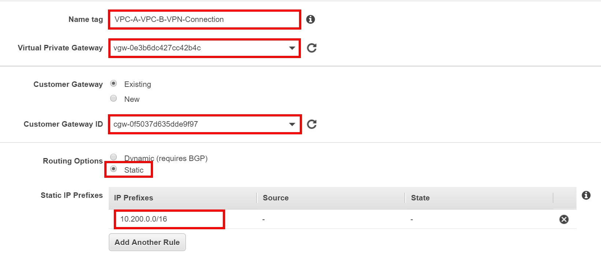
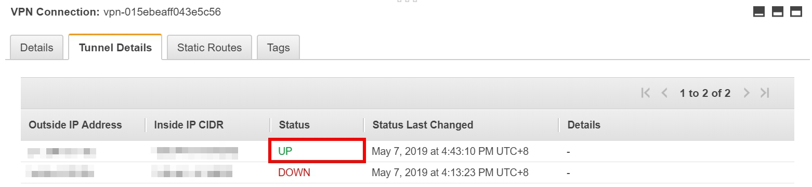

# How to Setup Site-to-Site VPN Connection

A **virtual private cloud (VPC)** is a virtual network dedicated to your AWS account. It is logically isolated from other virtual networks in the AWS Cloud. You can launch your AWS resources, such as Amazon EC2 instances, into your VPC. You can specify an IP address range for the VPC, add subnets, associate security groups, and configure route tables.

## Scenario

By default, instances that you launch into an **Amazon VPC** can't communicate with your own (remote) network. You can enable access to your remote network from your VPC by attaching a virtual private gateway to the VPC, creating a custom route table, updating your security group rules, and creating an **AWS Site-to-Site VPN (Site-to-Site VPN) connection**.

A **site-to-site VPN** allows offices in multiple fixed locations to establish secure connections with each other over a public network such as the internet. Site-to-site VPN extends the company's network, making computer resources from one location available to employees at other locations.

## Architecture

      
      

## Prerequisites

- An AWS account
- Download VPN-Connection.yml
- Putty for login to your EC2 (Windows only)

## Step by Step

### Create VPC environment and EC2 by CloudFormation

1. Download **VPN-Connection.yml** from this repository.

2. On the services menu, select **EC2**.

3. On the left navigation panel, select **Key Pairs**, then choose **Create Key Pair**.

4. For **key pair name**, type ``VPN-YourName``.

      
      

5. On the services menu, select **CloudFormation**, then choose **Create stack**.

6. For **Prerequisite**, choose **Template is ready**.

7. For **Specify template**, select **Upload a template file** and click choose file, choose **VPN-Connection.yml** you downloaded, 

8. Choose **Next**.

      
      

9. For **Stack name**, type ``VPN-LAB``.

10. For **Instance type**, choose **t2.micro**.

11. For **KeyName**, choose **VPN-YourName** that you created.

12. Choose **Next**, then choose **Next** again, until you get to the page **Review VPN-LAB**.

      
      

13. Choose **Create Stack**.

14. Wait for few minutes until the status of the Stack turn to **CREATE_COMPLETE**.

15. On the services menu, select **EC2**.

16. On the left navigation panel, select **Instances**, choose **EC2-B** -> choose **Actions** -> choose **Networking** -> chppse **Change Source/Dest. Check**, then choose **Yes, Disable**.

      
      

17. Choose **EC2-B**, copy the **IPv4 Public IP** to your notepad, we will use it later.

18. On the left navigation panel, select **Security Group**, then choose **VPC-B**.

19. On the bottom navigation panel, select **Inbound**, then choose **Edit**.

20. Change the **Source** of **SSH** into **My IP**, then choose safe.

      
      

### Create another VPC manually in different Region

1. **Chanege your region** that is different from the CloudFormation Stack you just created.

2. On the services menu, select **VPC**.

3. On the left navigation panel, select **Your VPCs**, then choose **Create VPC**.

4. Enter the following information for your VPC, then choose **Create**, leave other settings as default: 

- **Name tag**: ``VPC-A``
- **IPv4 CIDR block**: ``10.100.0.0/16``

      
      

5. On the left navigation panel, select **Internet Gateway**, then choose **Create internet gateway**.

6. For the **Name tag**, type ``VPC-A-IGW``, then choose **Create**.

7. Select ``VPC-A-IGW`` that you created, choose **Attatch**, then select ``VPC-A`` that you created, choose **Attach**.

8. On the left navigation panel, select **Subnets**, then choose **Create subnet**.

9. Enter the following information for your Subnet, then choose **Create**.

- **Name tag**: ``VPC-A-Public-Subnet``
- **VPC**: ``VPC-A``(the vpc that you just created)
- **Avialability Zone**: Choose the ``first AZ``  
- **IPv4 CIDR block**: ``10.100.0.0/24``

      
      

10. On the left navigation panel, select **Route Tables**, then choose **Create route table**.

11. Enter the following information for your route table, then choose **Create**:

- **Name tag**: ``VPC-A-Public-RT``
- **VPC**: ``VPC-A``(the VPC that you just created)

12. Select the Route table that you created, then choose **Routes** on the bottom navigation panel, then choose **Edit routes**.

13. Choose **Add routes**, then enter the following information, then choose **Save routes**:

- **Destination**: ``0.0.0.0/0``
- **Target**: ``Internet Gateway`` -> ``VPC-A-IGW``(the IGW that you created)

      
      

14. On the bottom navigation panel, select **Subnet Associations**, then choose **Edit subnet association**.

15. Choose **VPC-A-Public-Subnet** that you created, then choose **Save**.

      
      

### Launch an EC2 instance 

1. On the services menu, select **EC2**.

2. On the left navigation panel, select **Instances**, then choose **Launch Instance**.

3. For **Amazon Machine Image**, select **Amazon Linux 2 AMI (HVM), SSD Volume Type**.

      
      

4. For **Instance Type**, select **t2.micro**, then choose **Next: Configure Instance Detail**.

5. For **Configure Instance Details**, enter the following information and choose **Next: Add Storage**:

- **Network**: ``VPC-A``(the VPC you created)
- **Subnet**: ``VPC-A-Public-Subnet``(the Subnet you created)
- **Auto-assign Public IP**: Enable

      
      

6. Choose **Next: Add Tags**.

7. For **Add Tags**, choose **Add tag** and enter the following information, then choose **Next: Configure Security Group**:

- **key**: ``Name``
- **Value**: ``EC2-A``

      
      

8. For **Configure Security Group**, enter the following information:

- **Security group name**: ``VPC-A``
- **Description**: ``VPC-A``

9. For the role, choose **Add Rule**, then enter the information as the following image, then choose **Review and Launch**:

      
      

10. Choose **Launch**, you can either **create a new key or choose an existing key**.

11. Make sure your instance launched successfully.

### Create and configure VGW(Virtual Private Gateway) and CGW(Customer Gateway)

1. On the services menu, select **VPC**.

2. On the left navigation panel, select **Virtual Private Gateway**, then choose **Create Virtual Private Gateway**.

3. For the **Name tag**, enter ``VPC-A-VPC-B-VGW``, then choose **Create Virtual Private Gateway**.

      
      

4. Select **VPC-A-VPC-B-VGW** that you created, choose **Actions**, then choose **Attach to VPC**.

5. Select **VPC-A** you created, then choose **Yes, attach**.

6. On the left navigation panel, select **Customer Gateway**, then choose **Create Customer Gateway**.

7. For **Customer Gateway**, enter the following information then choose **Create Customer Gateway**:

- **Name**: ``VPC-B-CGW``
- **IP Address**: ``The public IP of EC2-B instance``

      
      

### Create VPN tunnels

1. On the left navigation panel, select **Site-to-Site VPN Connections**, then choose **Create VPN Connection**.

2. For **VPN Connection**, enter and choose the following information, then choose **Create VPN Connection**:

- **Name tag**: ``VPC-A-VPC-B-VPN-Connection``
- **Virtual Private Gateway**: ``VPC-A-VPC-B-VGW``
- **Customer Gateway ID**: ``VPC-B-CGW``
- **Route Options**: ``Static``
- **IP Prefixes**: ``10.200.0.0/16``(The IPv4 of VPC-B)

      
      

3. Wait for few minutes, them make sure the State of your VPN Connection is **available**. 

4. On the left navigation panel, select **Route Tables**, and choose **VPC-A-Public-RT** that you created.

5. On the bottom navigation panel, choose **Route Propagation**, then choose **Edit route propagation**.

6. Check the box of **VPC-A-VPC-B-VGW** that you created, then choose **Save**.

      
      

### Export the VPN configuration and configure the settings in EC2

1. On the left navigation panel, select **Site-to-Site VPN Connection**.

2. Select the **VPC-A-VPC-B-VPN-Connection** that you created, then choose **Download Configuration**.

3. For **Vendor**, choose **Generic**, leave other settings as default, then choose **Download**.

4. Open the configuration you downloaded with notepad, and we will use it later.

5. Login to **EC2-B** that created by CloudFormation, it should already finish installing and setting up **OpenSwan**.

> Follow the link: [Connect to Your Linux Instance](https://docs.aws.amazon.com/AWSEC2/latest/UserGuide/AccessingInstances.html)
to login to your EC2.

6. After you login into **EC2-B**, type:

- ``$ sudo su``

7. Run the following command to set up VPN Connection:

- ``$ vim /etc/ipsec.d/aws-vpn.conf``

8. Press **I** on your keyboard and add the following information :

- 
      conn Tunnel1
        authby=secret
        auto=start
        left=%defaultroute
        leftid=<Customer end VPN public IP>
        right=<AWS VPN Tunnel 1 public IP>
        type=tunnel
        ikelifetime=8h
        keylife=1h
        phase2alg=aes128-sha1;modp1024
        ike=aes128-sha1;modp1024
        keyingtries=%forever
        keyexchange=ike
        leftsubnet=<Customer end VPN CIDR>
        rightsubnet=<AWS end VPN CIDR>
        dpddelay=10
        dpdtimeout=30
        dpdaction=restart_by_peer

  - Open the configuration and find **Outside IP Addresses**.

  - Replace ``<Customer end VPN public IP>`` with the IP of **Customer Gateway** in the configuration.

  - Replace ``<AWS VPN Tunnel 1 public IP>`` with the IP of **Virtual Private Gateway** in the configuration.

  - Replace ``<Customer end VPN CIDR>`` with **10.200.0.0/16**.

  - Replace ``<AWS end VPN CIDR>`` with **10.100.0.0/16**.

  - After you finish setting the information above, press **esc** and type ``:wq!`` and press **enter** to quit.

9. Run the following command : 

- ``$ vim /etc/ipsec.d/aws-vpn.secrets``

10. Press **I** on your keyboard and add the following information :

- ``<customer_public_ip> <aws_vgw_public_ip>: PSK "<shared secret>"``

  - Replace ``<customer_public_ip>`` with the IP of **Customer Gateway** in the configuration.

  - Replace ``<aws_vgw_public_ip>`` with the IP of **Virtual Private Gateway** in the configuration.

  - Find **Pre-Shared Key** in the configuration.

  - Replace ``<shared secret>`` with the following string of the **Pre-Shared Key**.

  - After you finish setting the information above, press **esc** and type ``:wq!`` and press **enter** to quit.

11. Run the following command to enable/start ipsec service: 

- ``$ chkconfig ipsec on``

- ``$ service ipsec start``

- ``$ service ipsec status``

12. After you run the command above, you should see it appears **Active: active (running)**.

13. Do not stop the **EC2-B**, we will use it later. 

### Check the stability of the connection

1. Back to AWS console, on the services menu, select **VPC**.

2. On the left navigation panel, select **Site-to-Site VPN Connections**.

3. Select the VPN Connection you created, on the bottom navigation panel, choose **Tunnel Details**.

4. You should see one of the tunnel status shows **UP**, like the following image.

      
      

5. **Change your Region** to where you create the environment by CloudFormation.

6. On the services menu, select **EC2**, then choose the instance **EC2-B** that you created.

7. On the bottom navigation panel, choose **Description** and copy the **Private IPs**.

8. Go back to your **EC2-B** instance, run the following command:

- ``$ ping <Private IPs>``

  - Replace ``<Private IPs>`` with the IP that you just copied.

9. You should see the result as the following image, it means you successfully create a connection between two different VPC.

      
      

## Conclusion

Congratulations! You have learned how to :

- Deploy the environment by CloudFormation

- Create your own VPC 

- How to setup Site-to-Site VPN Connection

- Build a connection tunnel between two different VPC

## Cleanup

- CloudFormation Stack
- EC2 instances
- VPC
